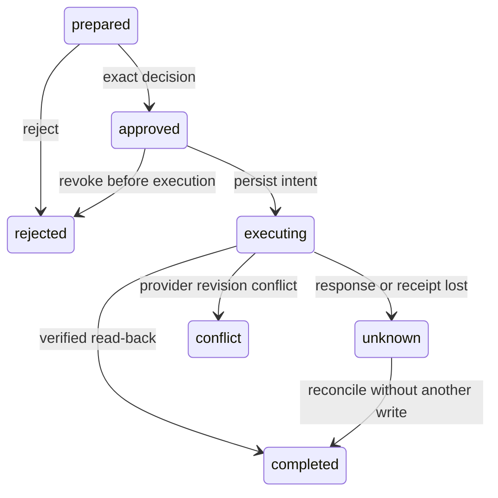

# Approved actions: local contract implementation

Status: mock-only, 2026-09-29. No real account is connected. There is no approval HTTP endpoint, runtime tool or credential store in this implementation.

## Delivered

- Typed calendar create/update requests require an explicit calendar, title and start/end. Timed events require zoned timestamps; all-day events require date-only boundaries with an exclusive end. Updates require event ID and ETag. Attendees, implicit duration and unrecognized fields are rejected.
- A proposal binds owner, connection/account, source commitment revision, exact parameters and expiry in its hash. Reusing an operation ID with changed parameters conflicts.
- Approval and rejection are revision-bound. Approval can be rejected before execution. Decisions retain actor/hash/time records; the mock control plane is not user authentication.
- Execution intent commits before the adapter runs. Read-back must match the connection, calendar, resource identity, ETag, proposal hash and proposed title/start/end/all-day flag before completion is recorded.
- Unknown outcomes only reconcile; they never repeat a write. Read-only reconciliation can establish an earlier result after approval expiry or source edits. Revoked connections block new provider access; historical receipts remain readable.
- Mock adapter state is scoped by connection, calendar and event ID. ETag conflicts cannot overwrite a changed event.

## Verification

`tests/test_server/test_connector_actions.py` has 17 checks covering timed/all-day requests, calendar/resource/ETag receipt identity, the full synthetic recovery demonstration, concurrent/replayed approval, source/expiry/revocation/owner checks, provider success before response, failed receipt persistence and recovery, ETag/account conflicts, payload tampering and unrelated read-back, invalid requests/non-mock adapter rejection, approved update, and approval rejection.

## Remaining before real accounts

1. Separate broker OS identity and secret storage; negative tests proving ordinary agent processes cannot read credentials or forge approvals.
2. Authenticated user-presence decisions, connection UI, account/scope display and real action previews.
3. Google OAuth transport, provider capability/error mapping, refresh/revoke, selected-message discovery and live create/update/read-back.
4. Runtime tools with run-scoped capabilities; prohibit alternate connected write paths below the model.
5. Production schema migrations, retention controls and operational recovery tests with a real provider.

Mock conformance is reusable implementation evidence; it does not satisfy these release gates.

Run `PYTHONPATH=src python -m dan.connectors` for the synthetic workflow. Saved evidence: [mock calendar evaluation](mock-calendar-evaluation-2026-09-29.json).
